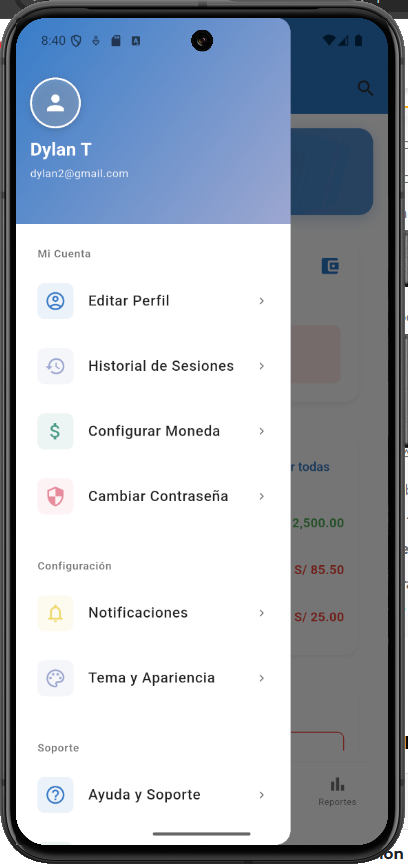
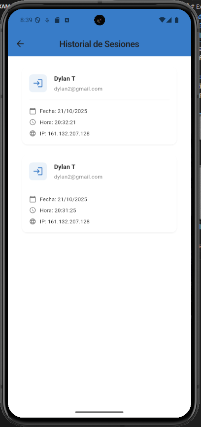
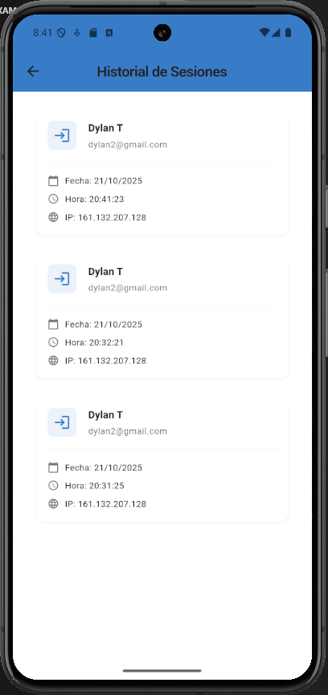

# SM2_EXAMEN_PRACTICO
## Examen Unidad II - Móviles II
## Alumno: Dylan Yariet Tapia Vargas
## Fecha: 21/10/2025
## URL del Repositorio: https://github.com/DylanTapiaVargas999/SM2_EXAMEN_PRACTICO

---

## Descripción del Proyecto

VanguarMoney es una aplicación móvil enfocada en el manejo de las finanzas personales, que permite a los usuarios registrar sus ingresos y egresos de manera fácil, rápida e intuitiva, ya sea mediante el uso de inteligencia artificial para el escaneo de imágenes o de forma manual. Además, ofrece la posibilidad de gestionar planes mensuales para optimizar el uso del dinero.

Gracias al uso de la inteligencia artificial, VanguarMoney puede generar análisis inteligentes y personalizados de los gastos de cada usuario, con el fin de brindar recomendaciones y ajustes al presupuesto, logrando así una mejor administración del dinero.

---

## Historia de Usuario

**Como** usuario autenticado,  
**Quiero** ver un historial de mis inicios de sesión,  
**Para que** pueda saber cuándo y desde qué dispositivo accedí a mi cuenta.

### Criterios de Aceptación
- Al iniciar sesión exitosamente, se registra el usuario, la fecha y hora del inicio, así como la dirección IP desde donde inició sesión.
- En la sección "Historial de inicios de sesión", el usuario puede ver una lista con:
  - Usuario, la Fecha y hora de inicio de sesión.
- Los registros se deben mostrar ordenados del más reciente al más antiguo.

---

## Descripción Breve de las Funcionalidades Implementadas

### Funcionalidades Implementadas

1. **Autenticación de Usuario**  
   - Los usuarios pueden iniciar sesión utilizando su correo y contraseña.
   - Se verifica la autenticidad de las credenciales y se permite el acceso a la aplicación si son correctas.

2. **Registro de Inicios de Sesión**  
   - Cada inicio de sesión es registrado con la fecha, hora y dirección IP desde donde el usuario ha accedido.
   - Esta información se almacena en una base de datos para ser recuperada posteriormente.

3. **Historial de Inicios de Sesión**  
   - El usuario puede acceder a una sección donde se muestra un historial detallado de sus inicios de sesión.
   - Los registros se presentan ordenados de forma descendente (más reciente primero).

---

## Capturas de Pantalla

### 1. Boton de la implementacion

### 2. Pantalla de Historial antes del Incio de sesion

### 3. Pantalla de Historial despues del Inicios de Sesión

